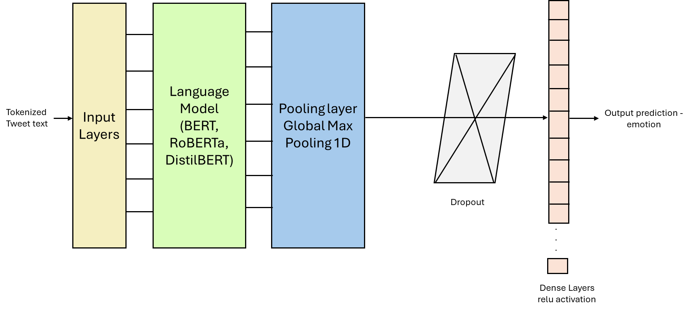

# Mental State Analysis of Social Media Users | Emotions Classification on Twitter Tweets 
## Project Aim:
The purpose of this project is to examine the different NLP models for the purpose of analyzing the mental health state and predicting the different types of emotion expressed on Social Media platforms by the users. For this reason, the Twitter dataset from the Hugging Face platform has been considered, containing around 5.05k labeled data records split between train, test and validation sets with four classes of emotions:

0-> anger\
1-> joy\
2-> optimism\
3-> sadness

## Dataset

- **Source:** [tweet_eval on Hugging Face](https://huggingface.co/datasets/tweet_eval)
- **Files Needed:** `train.parquet`, `validation.parquet`, `test.parquet`

## Models Explored:
1. Linear Support Vector Classifier (SVC)
2. Bidirectional Long-Short Term Memory (BiLSTM)
3. BERT
4. RoBERTa
5. DistilBERT
   
## Proposed Solution:
Text Processing Steps using text_hammer include:
1.   Changing to lower case
2.   Expanding words like you're to you are, i'm to I am
3.   Removing emails
4.   Removing HTML tags
5.   Removing special characters like @, #, % etc
6.   Removing accented characters like u^, `a etc

DistilBERT with the following hyperparameters:

•	learning_rate: 1e-5\
•	batch_size: 64\
•	decay: 1e-8\
•	optimizer: Adam\
•	epochs: 12

## Architecture



## Requirements

- Python 3.8+
- Jupyter Notebook or Google Colab
- [transformers==4.31.0](https://pypi.org/project/transformers/4.31.0/)
- [text_hammer](https://pypi.org/project/text-hammer/)
- [accelerate](https://pypi.org/project/accelerate/)
- [tensorflow](https://pypi.org/project/tensorflow/)
- [scikit-learn](https://scikit-learn.org/)
- [imbalanced-learn](https://imbalanced-learn.org/)
- [matplotlib](https://matplotlib.org/)
- [seaborn](https://seaborn.pydata.org/)
- [pandas](https://pandas.pydata.org/)
- [numpy](https://numpy.org/)

Install all requirements with:
```sh
pip install -r requirements.txt
```
Or individually:
```sh
pip install transformers==4.31.0 text_hammer accelerate tensorflow scikit-learn imbalanced-learn matplotlib seaborn pandas numpy
```

## Setup

1. **Clone the repository**
   ```sh
   git clone https://github.com/Kamatchi-23/EmotionClassification.git 
   cd EmotionClassification
   ```

2. **Download the dataset**  
   Download the [tweet_eval dataset](https://huggingface.co/datasets/tweet_eval) and place `train.parquet`, `validation.parquet`, and `test.parquet` in the project directory.

3. **(Optional) Google Colab**  
   If using Colab, mount your Google Drive and upload the dataset files as shown in the notebook.

## How to Run

1. **Open the notebook**  
   Open `final_implementation.ipynb` in Jupyter Notebook or upload to Google Colab.

2. **Run all cells**  
   Execute the notebook cells sequentially. The notebook will:
   - Preprocess the data
   - Train and evaluate SVM, BiLSTM, BERT, RoBERTa, and DistilBERT models
   - Fine-tune the best models
   - Show evaluation metrics and confusion matrices
   - Allow custom tweet inference

3. **Custom Inference**  
   At the end of the notebook, use the provided input cell to classify your own tweet:
   ```python
   usr_input = input("Enter your tweet:")
   print(get_prediction(usr_input, model_distilbert_tuned, distilbert_tokenizer_tuned))
   ```

## Results

- **Best Model:** Fine-tuned DistilBERT
- **Test F1 Score:** 0.7917
- **Test Accuracy:** 0.7952

## File Details

- `final_implementation.ipynb` — Final implementation of all models, results, and custom inference.
- `SVM_and_BERT_implementation.ipynb` — Exploration and implementation of SVM and BERT.
- `StopWords_removed_implementation.ipynb` — Experimental implementation with stop words removal and lemmatization. It was observed that performance was slightly lower with stop words removed which could be attributed to the loss of data with stop words removed from short pieces of texts such as tweets, where the given dataset contained maximum length of tweets to be containing 33 words even without basic cleaning

## Notes

- For best performance, use a GPU-enabled environment (e.g., Google Colab).
- If you have rendering issues with notebooks on GitHub, use [nbviewer](https://nbviewer.org/).

## References

1. Cahyani, D. E., & Patasik, I. (2021). Performance comparison of TF-IDF and Word2Vec models for emotion text classification. Bulletin of Electrical Engineering and Informatics, 10(5), 2780–2788. https://doi.org/10.11591/eei.v10i5.3157
2. Twitter Sentiment Analysis with BERT + RoBERTa 🐦. (n.d.). Kaggle.com. https://www.kaggle.com/code/mrehanzafar/twitter-sentiment-analysis-with-bert-roberta#Loading-the-data
3. Text-Based Emotion Classification Using LTSM. (n.d.). Kaggle.com. https://www.kaggle.com/code/bastisei/text-based-emotion-classification-using-ltsm#Load-and-Prepare-Data
4. Ameer, I., Arif, M., Sidorov, G., Gòmez-Adorno, H., & Gelbukh, A. (2022). Mental Illness Classification on Social Media Texts using Deep Learning and Transfer Learning. https://doi.org/10.48550/arxiv.2207.01012
5. Robinson, L., & Smith, M. (2024, May 3). Social Media and Mental Health: Social Media Addiction. https://www.helpguide.org/articles/mental-health/social-media-and-mental-health.htm
6. Clark, M. (2020, November 12). 40+ Frightening Social Media and Mental Health Statistics — Etactics. https://etactics.com/blog/social-media-and-mental-health-statistics
